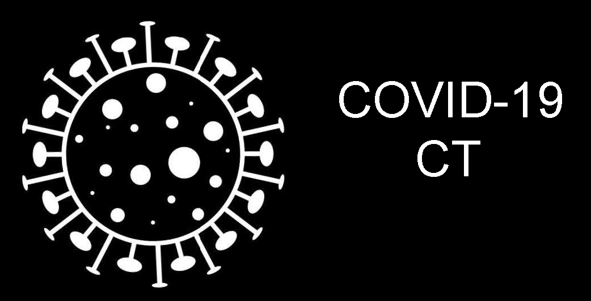
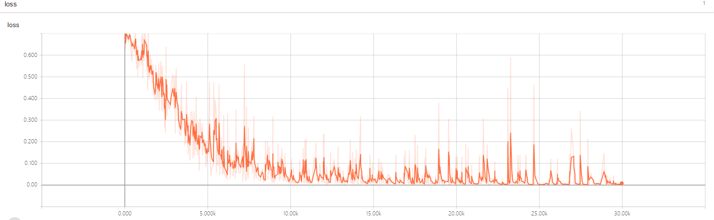
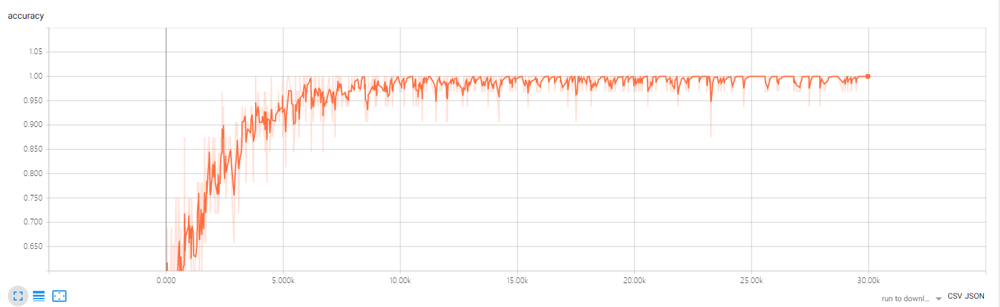

# COVID-CT19-Challenge
> This is an example of classifying each CT image into positive COVID-19 (the image has  clinical findings of COVID-19) or negative COVID-19 ( the image does not have clinical findings of COVID-19).

## Prerequisities
The following dependencies are needed:
- numpy >= 1.11.1
- opencv-python >=3.3.0
- tensorflow-gpu ==1.8.0
- pandas >=0.20.1
- scikit-learn >= 0.17.1

## Downlod DataSet

* you can download dataset from here [link](https://github.com/UCSD-AI4H/COVID-CT)
* The dataset details are described in this preprint: [COVID-CT-Dataset: A CT Scan Dataset about COVID-19](https://arxiv.org/pdf/2003.13865.pdf)

* If you find this dataset and code useful, please cite:

    @article{zhao2020COVID-CT-Dataset,
      title={COVID-CT-Dataset: a CT scan dataset about COVID-19},
      author={Zhao, Jinyu and Zhang, Yichen and He, Xuehai and Xie, Pengtao},
      journal={arXiv preprint arXiv:2003.13865}, 
      year={2020}
    }

## How to Use

**1、Preprocess**

* split source data into training data,validation data,test data.
* augmentation training data
* write all data into csv file:you can run the data2dprepare.py one step by one.

**2、Positive and Negative COVID-19 Classify**
* the RestNet model

* training process:run the ResNet2d_train.py
* predict process:run the ResNet2d_predict.py

## Result

* the train loss and accuracy

* test data result:F1 score is 0.76,AUC area is 0.82,accuracy is 0.76.

## Contact
* https://github.com/junqiangchen
* email: 1207173174@qq.com
* Contact: junqiangChen
* WeChat Number: 1207173174
* WeChat Public number: 最新医学影像技术
